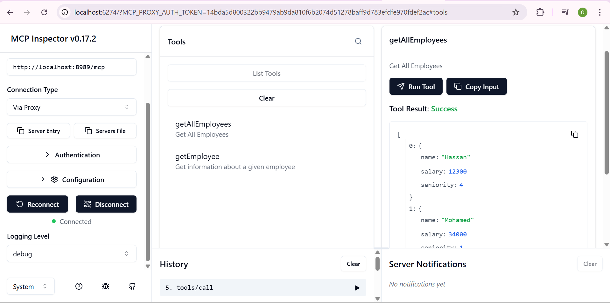
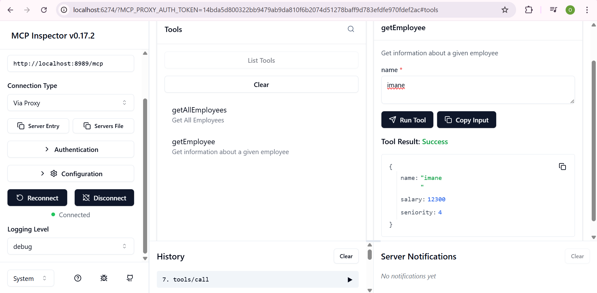
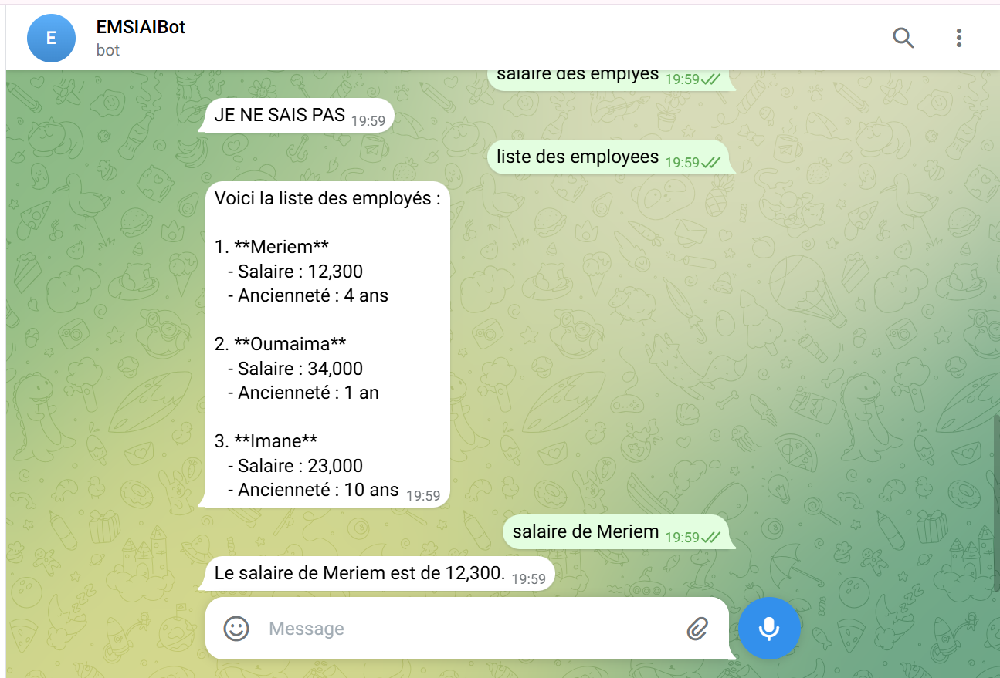

# Chat Bot avec MCP (Model Context Protocol)

## 📋 Description

Ce projet est un chatbot intelligent développé avec Spring Boot qui intègre le protocole MCP (Model Context Protocol) pour la gestion des employés. Le bot est accessible via Telegram et communique avec un serveur MCP pour récupérer et manipuler les données des employés.

## 🏗️ Architecture

Le projet est composé de deux modules principaux :

- **chat-bot** : Application principale du chatbot Telegram
- **mcp-server** : Serveur MCP qui expose les outils de gestion des employés

## ✨ Fonctionnalités

### Outils MCP disponibles :

1. **getEmployee** : Récupère les informations d'un employé spécifique
    - Paramètre : `name` (nom de l'employé)
    - Retourne : nom, salaire, ancienneté

2. **getAllEmployees** : Récupère la liste complète de tous les employés
    - Retourne : liste avec détails de chaque employé

### Bot Telegram :

Le bot répond aux commandes suivantes :
- Liste des employés
- Informations d'un employé spécifique
- Salaire d'un employé

## 🛠️ Technologies utilisées

- **Java** avec Spring Boot
- **Spring AI** pour l'intégration avec OpenAI (GPT-4)
- **MCP (Model Context Protocol)** pour la communication entre services
- **Telegram Bot API** pour l'interface utilisateur
- **Maven** pour la gestion des dépendances


2. Configurez les variables d'environnement :

**Windows (PowerShell) :**
```powershell
[System.Environment]::SetEnvironmentVariable('OPENAI_API_KEY', 'votre-clé-openai', 'User')
[System.Environment]::SetEnvironmentVariable('TELEGRAM_BOT_TOKEN', 'votre-token-telegram', 'User')
```

**Linux/Mac :**
```bash
export OPENAI_API_KEY="votre-clé-openai"
export TELEGRAM_BOT_TOKEN="votre-token-telegram"
```

3. Le fichier `application.properties` utilise ces variables :
```properties
spring.application.name=chat-bot
server.port=8087

# OpenAI Configuration
spring.ai.openai.api-key=${OPENAI_API_KEY}
spring.ai.openai.chat.options.model=gpt-4o
spring.ai.openai.chat.options.temperature=0.7

spring.ai.mcp.client.streamable-http.connections.mcprh.url=http://localhost:8989/mcp

telegram.api.key=${TELEGRAM_BOT_TOKEN}
```

## 🚀 Démarrage

### 1. Démarrer le serveur MCP

```bash
cd mcp-server
mvn spring-boot:run
```

Le serveur MCP démarre sur `http://localhost:8989`

### 2. Démarrer le chatbot

```bash
cd ..
mvn spring-boot:run
```

Le chatbot démarre sur `http://localhost:8087` et se connecte automatiquement à Telegram.

## 📸 Captures d'écran

### Interface MCP Inspector


*Interface de test de l'outil `getEmployee` qui récupère les informations d'un employé spécifique*


*Interface de test de l'outil `getAllEmployees` qui liste tous les employés*

### Bot Telegram en action


*Le bot répond avec la liste complète des employés incluant nom, salaire et ancienneté*

## 🔧 Utilisation du MCP Inspector

Le MCP Inspector est disponible à l'adresse : `http://localhost:6274/`

Il permet de :
- Tester les outils MCP disponibles
- Visualiser les résultats en temps réel
- Déboguer les appels MCP

## 💬 Utilisation du Bot Telegram

Une fois le bot démarré, recherchez votre bot sur Telegram et commencez une conversation avec `/start`.

Exemples de commandes :
- "Liste des employés"
- "Informations sur Hassan"
- "Salaire de Meriem"
- "Ancienneté d'Imane"
